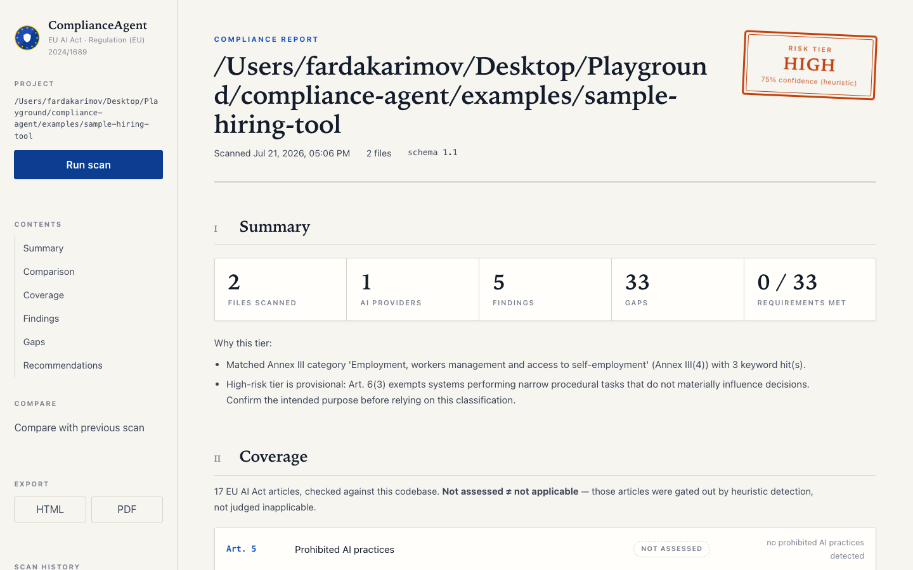

# ComplianceAgent

**Check if your AI project follows EU rules.**

[](https://github.com/latreon/compliance-agent/actions)
[](https://www.python.org/downloads/)
[](LICENSE)

The EU has new rules for AI. If you're building with OpenAI, Anthropic, LangChain,
or any AI framework, you need to check whether you comply. This tool gives you a
fast, automated first pass — one command, about 5 seconds. It is a heuristic aid,
not legal advice, and does not by itself establish compliance.

[30-Second Start](#30-second-start) · [What It Does](#what-it-does-simple-version) · [How It Works](#how-it-works) · [Examples](#real-examples) · [All Commands](#command-reference) · [FAQ](#common-questions)

---

## 30-Second Start

```bash
# Install (isolated CLI tool)
uv tool install compliance-agent
# no uv? use:  pipx install compliance-agent

# Check your project
compliance-agent scan .

# Done. Read what it found.
```

## What It Does (Simple Version)

1. **Scans your code** — finds where you use AI (OpenAI, LangChain, etc.).
2. **Checks the rules** — compares your code against EU AI Act requirements.
3. **Tells you what's missing** — shows exactly what you need to fix.
4. **Gives you the code** — provides copy-paste fixes for each problem.

## What You'll See

When you run `compliance-agent scan .`, you get a boxed terminal report:
a header, a summary strip, per-article coverage, findings, and the gaps to
fix. Illustrative shape (real output for the bundled sample is in
[examples/EXPECTED_OUTPUT.md](examples/EXPECTED_OUTPUT.md)):

```text
╭─ EU AI Act Compliance Report ──────────────────────────────╮
│   Files scanned  3                                         │
│      Risk tier   LIMITED                                   │
╰──────────────────────────────────────────── ComplianceAgent ╯

╭─ Scan Summary ─────────────────────────────────────────────╮
│    3           1            6            9                  │
│  FILES     AI SYSTEMS    FINDINGS      GAPS                 │
╰────────────────────────────────────────────────────────────╯

╭─ Compliance Gaps ──────────────────────────────────────────╮
│ ✗ MISSING  Automated logging of AI events required (Art.12) │
│   Fix: templates/art12/event_logging.py                    │
│ ✗ MISSING  AI transparency disclosure required (Art. 50)   │
│   Fix: templates/art50/transparency_notice.py              │
│ ✗ MISSING  Error handling around AI calls (Art. 15)        │
│   Fix: add try/except + fallbacks around model calls       │
╰────────────────────────────────────────────────────────────╯

Next: compliance-agent recommend . --output ./fixes
```

Prefer a file? `scan --format pdf --output report.pdf` writes a PDF, and the
separate `report` command writes markdown or PDF to disk. For `scan`,
`--format markdown` and `--format json` render to the terminal/stdout — pipe
`json` to a file if you need one (see [Command Reference](#command-reference)).

## Do I Need This?

**Yes, if you:**

- Use OpenAI, Anthropic, Google, or any AI API
- Build chatbots or AI assistants
- Use LangChain, CrewAI, AutoGen, or LangGraph
- Deploy AI in the EU or serve EU users
- Want to avoid fines (up to €15M / 3% of turnover for most obligations, and
  up to €35M / 7% for prohibited practices)

**No, if you:**

- Don't use AI in your project
- Only use AI for personal projects (not a business)
- Don't operate in, or serve users in, the EU

## Installation

ComplianceAgent is a command-line tool, so the cleanest way to install it is
with a tool installer that keeps it in its own isolated environment.

### Recommended (isolated CLI install)

```bash
uv tool install compliance-agent
```

or, with pipx:

```bash
pipx install compliance-agent
```

No `uv` or `pipx` yet? Install one:

```bash
brew install uv        # or: brew install pipx
```

### Alternative: pip inside a virtual environment

On modern macOS/Linux, a bare `pip install` into the system Python is blocked
(PEP 668, "externally-managed-environment"). Use a virtual environment:

```bash
python3 -m venv .venv
source .venv/bin/activate    # Windows: .venv\Scripts\activate
pip install compliance-agent
```

### Latest unreleased version (from GitHub)

```bash
uv tool install git+https://github.com/latreon/compliance-agent.git
# or:  pipx install git+https://github.com/latreon/compliance-agent.git
```

### Verify it worked

```bash
compliance-agent version
# ComplianceAgent v0.3.0
```

Trouble installing or running? See the [Troubleshooting guide](docs/TROUBLESHOOTING.md).

## How It Works

### Step 1: Scan your code

The scanner reads your project files and looks for AI-related patterns:

- `import openai` — you're using OpenAI
- `from langchain` — you're using LangChain
- `AgentExecutor()` — you're running an AI agent
- `client.chat.completions.create()` — you're calling an AI API

**Provider and framework detection uses AST parsing** (not just text search):
they only fire in files that actually `import` the library, so a comment that
mentions "OpenAI" won't trigger a provider finding. Lightweight keyword patterns
(e.g. chat-interface wording) additionally scan documentation and config, so a
small number of findings can come from `.md` files.

### Step 2: Classify risk

Based on what it finds, the tool assigns a risk level:

| Risk Level | What It Means | Rules That Apply |
|------------|---------------|------------------|
| **MINIMAL** | Basic AI usage, no user interaction | Almost none |
| **LIMITED** | AI interacts with users | Transparency rules (Art. 50) |
| **HIGH** | AI used in an Annex III domain (hiring, credit, biometrics, law enforcement, …) | Full compliance required |
| **UNACCEPTABLE** | Banned AI practices (Art. 5) | Cannot be deployed |

> **How the tier is decided.** HIGH risk under the EU AI Act comes from the
> *use-case domain* ([Annex III](rules/annex3.yaml)), not from technical
> capability. An autonomous agent with tools is not automatically high-risk — a
> résumé-screening or credit-scoring system is. ComplianceAgent classifies HIGH
> only when it detects Annex III domain indicators, and UNACCEPTABLE only when it
> detects a likely Art. 5 prohibited practice (e.g. social scoring, untargeted
> facial scraping). Domain indicators are matched against file paths **and code
> content** (not just file names), but only for projects that actually use AI.
> Both are keyword-based heuristics and provisional (Art. 6(3) also exempts some
> narrow-purpose systems), so a match is a prompt to self-assess and consult
> counsel — not a legal determination. See
> [docs/ARCHITECTURE.md](docs/ARCHITECTURE.md#risk-classification) for how tiers
> are decided.

### Step 3: Check compliance

The tool checks 13 specific articles of the EU AI Act:

| Article | What It Checks | When It Matters |
|---------|----------------|-----------------|
| Art. 50 | "You're talking to AI" notice | Any user-facing AI |
| Art. 12 | Logging AI conversations | Obligation for high-risk; best practice for all AI |
| Art. 14 | Human oversight for decisions | High-risk / agentic AI |
| Art. 15 | Error handling and robustness | Obligation for high-risk; best practice for all AI |
| ... | [see the full list](#compliance-coverage) | ... |

### Step 4: Recommend fixes

For each issue found, the tool:

1. Explains what's wrong
2. Shows which rule requires the fix
3. Provides a code template you can copy
4. Tells you exactly where to put it

```text
ISSUE: No "You're talking to AI" notice
RULE:  EU AI Act Article 50(1)
FIX:   Copy templates/art50/transparency_notice.py into your project
WHERE: Add it before your chat endpoint
```

## Real Examples

### Example 1: Simple chatbot (Limited risk)

A basic chatbot using OpenAI:

```python
# chatbot.py
import openai

client = openai.OpenAI()

def chat(user_input):
    return client.chat.completions.create(
        model="gpt-4",
        messages=[{"role": "user", "content": user_input}],
    ).choices[0].message.content
```

Scan result (illustrative summary — exact wording/counts come from the scan):

```text
Risk tier: LIMITED — user-facing AI, no Annex III high-risk domain matched
Gaps:      Art. 12 (record-keeping), Art. 50 (transparency), Art. 15 (robustness)
Fix:       add a transparency notice + event logging + error handling
```

### Example 2: LangChain agent (Higher risk)

An agent that can search the web and send emails:

```python
# agent.py
from langchain.agents import AgentExecutor
from langchain.tools import Tool

tools = [
    Tool(name="search", func=search_web, description="Search the web"),
    Tool(name="email", func=send_email, description="Send an email"),
]

executor = AgentExecutor(agent=agent, tools=tools)
```

Scan result (illustrative — the tier is HIGH only if your code also matches an
Annex III high-risk domain; agentic patterns on their own drive the oversight
and logging gaps below):

```text
RISK: LIMITED (no Annex III high-risk domain detected)
FRAMEWORKS: LangChain (agent, tools)
ISSUES: several, including
  1. No human oversight before tool use (Art. 14)
  2. No logging of tool calls (Art. 12)
  3. No error handling for API failures (Art. 15)
  4. No "You're talking to AI" notice (Art. 50)
FIX: Add human-in-the-loop, logging, error handling, transparency.
```

> Note: tool access raises real Art. 14 oversight and Art. 12 logging gaps, but
> it does **not** by itself make the system HIGH risk. The tier becomes HIGH
> only if the agent operates in an Annex III domain (e.g. hiring, credit,
> biometrics) — see [How the tier is decided](#step-2-classify-risk).

### Example 3: CrewAI multi-agent

A crew of agents researching and writing:

```python
# crew.py
from crewai import Agent, Task, Crew

researcher = Agent(role="Researcher", tools=[search])
writer = Agent(role="Writer", tools=[write])

crew = Crew(
    agents=[researcher, writer],
    tasks=[Task(description="Research", agent=researcher),
           Task(description="Write", agent=writer)],
)
crew.kickoff()
```

Scan result (illustrative):

```text
RISK: LIMITED (multi-agent, but no Annex III high-risk domain detected)
FRAMEWORKS: CrewAI (agent, crew, task)
ISSUES: several, including
  1. No oversight before crew execution (Art. 14)
  2. No logging of agent actions (Art. 12)
  3. No technical documentation (Art. 11)
FIX: Add an approval workflow, logging, and documentation.
```

> A crew researching and writing is not, by itself, an Annex III high-risk
> use-case, so the tier stays LIMITED. Point the same crew at résumé screening
> or credit decisions and the tier becomes HIGH.

### Example 4: Hiring tool (High risk) — real scan output

The three examples above are illustrative snippets. This one is a real,
runnable project — [`examples/sample-hiring-tool`](examples/sample-hiring-tool)
scores job applicants (Annex III(4): employment) and is HIGH risk, not
LIMITED, so every Chapter III, Section 2 obligation applies:

```bash
compliance-agent scan examples/sample-hiring-tool
```

```text
Risk tier: HIGH — matched Annex III(4) "employment, workers management and
           access to self-employment" (3 keyword hits)
Gaps:      28, spanning Art. 6, 9, 10, 11, 12, 13, 14, 15, 16, 17, 26, 27, 43, 50
Fix:       compliance-agent recommend examples/sample-hiring-tool --output ./fixes
           -> 14 recommendations, one real template per article
```

Full real output, including every gap and finding, is in
[`examples/sample-hiring-tool/EXPECTED_OUTPUT.md`](examples/sample-hiring-tool/EXPECTED_OUTPUT.md).

### Example 5: Multi-framework pipeline — real scan output

Real agent projects rarely use one framework.
[`examples/sample-multi-framework`](examples/sample-multi-framework) combines
LangChain (chain + tool + memory), CrewAI (a researcher/writer crew), and
LangGraph (the state graph orchestrating both) in one file:

```bash
compliance-agent scan examples/sample-multi-framework
```

```text
Frameworks: crewai, langchain, langgraph — detected and reported separately
Gaps:       Art. 11, 12, 14 (x2), 50 — deduplicated across frameworks, not
            one redundant copy per framework
```

Full real output is in
[`examples/sample-multi-framework/EXPECTED_OUTPUT.md`](examples/sample-multi-framework/EXPECTED_OUTPUT.md).

### More runnable examples

| Example | Shows |
|---------|-------|
| [`sample-chatbot`](examples/sample-chatbot) | LIMITED risk, the minimal case |
| [`sample-hiring-tool`](examples/sample-hiring-tool) | HIGH risk (Annex III), every Chapter III obligation, all 14 fix templates |
| [`sample-multi-framework`](examples/sample-multi-framework) | LangChain + CrewAI + LangGraph detected and deduplicated in one project |
| [`sample-ci-cd`](examples/sample-ci-cd) | A copy-paste GitHub Actions workflow that gates a PR on `--fail-on` |
| Web dashboard | See [Web Dashboard](#web-dashboard) below — a real screenshot from `compliance-agent serve` |

## Command Reference

```bash
# Scan a folder (. means the current folder)
compliance-agent scan .

# Output types
compliance-agent scan . --format markdown   # for reading (default); raw Markdown when piped
compliance-agent scan . --format json       # for computers / CI, to stdout
compliance-agent scan . --format sarif --output results.sarif  # GitHub code scanning
compliance-agent scan . --format pdf --output report.pdf    # PDF file (-o alias)
compliance-agent scan . --format html --output dash.html    # interactive dashboard file

# Only show serious issues (info | warning | high | critical)
compliance-agent scan . --severity high

# Skip folders (repeatable)
compliance-agent scan . --exclude "tests/*" --exclude "docs/*"

# Only check matching folders (repeatable allow-list)
compliance-agent scan . --include "src/*"

# Quieter / plainer output
compliance-agent scan . --quiet             # summary only, no per-finding detail
compliance-agent scan . --no-color          # disable colored output
compliance-agent scan . --verbose           # show what is scanned + info logs
compliance-agent scan . --no-update-check   # skip the PyPI version check

# Show how to fix each problem
compliance-agent scan . --fix

# Copy fix templates into your project
compliance-agent recommend . --output ./fixes
compliance-agent recommend . --format json    # machine-readable recommendations

# Make a shareable report file
compliance-agent report . --output audit-2026.pdf
compliance-agent report . --format html --output audit-2026.html

# Open the local web dashboard (requires the 'web' extra)
compliance-agent serve .

# For CI/CD: plain output, fail the build on serious issues
compliance-agent scan . --ci --fail-on high

# Upgrade to the latest (or a specific) version
compliance-agent upgrade
compliance-agent upgrade 0.1.2

# Show the installed version (and whether an update is available)
compliance-agent version
compliance-agent --version          # -V: quick version, then exit
```

Run `compliance-agent scan --help` to see every option explained.

**Staying up to date.** After a scan, ComplianceAgent tells you if a newer
version is on PyPI, then `compliance-agent upgrade` updates it in place
(auto-detecting whether you installed with `uv`, `pipx`, or `pip`). The check is
cached for a day, never blocks a scan, and is skipped in CI and JSON output.
Disable it with `--no-update-check`, `COMPLIANCE_AGENT_NO_UPDATE_CHECK=1`, or the
conventional `NO_UPDATE_NOTIFIER=1`.

**Exit codes:** `0` success · `1` `--fail-on` threshold met · `2` usage error.

**What gets scanned.** `.gitignore` is honored automatically, and vendored
directories (`node_modules`, `.venv`, `dist`, `build`, caches, …) are always
skipped. Only `.py`, `.yaml`, `.yml`, `.json`, `.toml`, and `.md` files are read;
other file types are ignored. Files larger than 1 MB are skipped for speed.

JSON output is a versioned envelope — safe to parse in CI:

```json
{
  "schema_version": "1.0",
  "tool_name": "ComplianceAgent",
  "tool_version": "0.3.0",
  "disclaimer": "This tool performs automated, heuristic technical analysis — not legal advice — ...",
  "scan_result": { "files_scanned": 3, "risk_tier": "limited", "findings": [{ "id": "...", "severity": "warning", "category": "..." }] }
}
```

SARIF output (`--format sarif`) is a standard [SARIF 2.1.0](https://docs.oasis-open.org/sarif/sarif/v2.1.0/sarif-v2.1.0.html)
log: findings map to per-file results at their detected line, compliance gaps
map to project-level results, and severities carry GitHub `security-severity`
scores — see [CI/CD Integration](#cicd-integration) for wiring it into the
GitHub Security tab.

## Project config file (`compliance.yaml`)

Stop re-typing flags: declare your AI posture and scan defaults once, in a
`compliance.yaml` (or `.compliance.yaml`) at the project root. Every command
(`scan`, `recommend`, `report`, `serve`) picks it up automatically.

```yaml
# compliance.yaml
version: 1

posture:
  # Declared EU AI Act risk tier for this project. A declaration can only
  # RAISE the detected tier (unlocking the high-risk article checks) — it can
  # never lower it, so a config file cannot manufacture false assurance.
  risk_tier: high
  intended_purpose: "CV screening assistant for the recruiting team"

scan:
  exclude:            # same syntax as --exclude
    - "docs/*"
    - "notebooks/*"
  include: []         # same syntax as --include
  fail_on: high       # same as --fail-on (CI gate)
  severity: warning   # same as --severity (display filter)
  format: markdown    # default --format
  output: null        # default --output
```

Rules of precedence:

- **Explicit CLI flags always win** over the config file.
- A **broken config is a hard error** (exit code `2`), never silently
  ignored — a typo in `fail_on` must not quietly disable a CI gate.
- `posture.risk_tier` participates in classification: declaring `high` on a
  project the heuristics see as `limited` raises the tier (with the reason
  recorded in the report); declaring `minimal` on a project detected as
  `high` changes nothing except a note that the higher tier applies.

## What It Detects

**AI providers**

- OpenAI (GPT-4, GPT-4o, o1)
- Anthropic (Claude)
- Google (Gemini)
- Mistral
- Local models (Ollama, vLLM, transformers, llama.cpp, torch)

**Agent patterns**

- MCP servers and tool definitions
- Tool calls and function calling
- Multi-agent orchestration (CrewAI, AutoGen, LangGraph)
- Prompt templates and system prompts

### Framework-aware detection

Beyond generic provider detection, dedicated detectors understand what each
framework construct means for compliance (only in files that actually import the
framework — AST-verified):

| Framework | Detection | Compliance Mapping |
|-----------|-----------|--------------------|
| LangChain | Agents, tools, memory, chains | Art. 14 (oversight), Art. 12 (logging), Art. 11 (docs) |
| CrewAI | Crews, agents, tasks, processes | Art. 14 (oversight), Art. 12 (logging), Art. 11 (docs) |
| AutoGen | Agents, group chat, function/code execution | Art. 14 (oversight), Art. 12 (logging) |
| LangGraph | State graphs, conditional edges, tool nodes, checkpoints | Art. 12 (logging), Art. 11 (docs), Art. 14 (oversight) |

## Compliance Coverage

ComplianceAgent checks the following EU AI Act articles and reports a per-article
status (Met / Partial / Unverified / Missing / Not assessed). "Not assessed"
means the article was gated out by heuristic detection (e.g. the tier stayed
LIMITED) — it is not a finding that the obligation does not apply, so verify
those articles manually. A requirement is
**Met** only when a verifiable signal is found — a code construct or a concrete
artifact file (comments are stripped before matching, so a `# TODO` note can't
satisfy a requirement). An obligation merely *named* in documentation prose or a
code comment, with no implementing mechanism, is reported as **Unverified**
("verify manually"), never as compliant. Matching is still heuristic — a token
appearing in unrelated code can over-credit a requirement — so treat **Met** as
"signal found, verify manually", not proof of compliance:

| Article | Title | When Applicable |
|---------|-------|-----------------|
| 5 | Prohibited practices | Prohibited-practice indicators (UNACCEPTABLE tier) |
| 6 | High-risk definition | High-risk tier |
| 9 | Risk management | High-risk tier |
| 10 | Data governance | Data processing or high-risk tier |
| 11 | Technical documentation | High-risk obligation; flagged as best practice for any AI usage |
| 12 | Record-keeping | High-risk obligation; flagged as best practice for any AI usage |
| 13 | Transparency to deployers | High-risk tier only |
| 14 | Human oversight | Agentic patterns or high-risk tier |
| 15 | Accuracy, robustness, cybersecurity | High-risk tier only |
| 16 | Provider obligations | High-risk tier |
| 17 | Quality management system | High-risk tier |
| 24 | Distributor obligations | Deployment artifacts present |
| 26 | Deployer obligations | High-risk tier |
| 27 | Fundamental rights impact assessment | High-risk tier (narrower scope: public bodies, credit/insurance) |
| 43 | Conformity assessment | High-risk tier |
| 50 | User transparency | User-facing AI |

All 16 articles above have a working fix template — see
[Fix Templates](#fix-templates) below.

## Fix Templates

ComplianceAgent doesn't just find problems — it ships solutions. Every gap maps to
a real, copy-pasteable template ([index](templates/README.md)):

| Article | Template | Purpose |
|---------|----------|---------|
| 5 | `prohibited_practice_escalation.py` | Deployment-blocking gate + legal-clearance record |
| 6 | `intended_purpose_classification.py` | Intended-purpose and Annex III classification record |
| 9 | `risk_management.py` | Risk register and review cycle |
| 10 | `data_governance.py` | Dataset provenance cards |
| 11 | `technical_documentation.py` | Annex IV technical documentation generator |
| 12 | `event_logging.py` | AI event logging with retention + cleanup |
| 13 | `instructions_for_use.py` | Instructions-for-use generator (purpose, accuracy, limitations) |
| 14 | `human_oversight.py` | Human-in-the-loop checkpoints with audit trail |
| 15 | `robustness_and_security.py` | Guarded-call decorator, rate limiter, input validation, accuracy log |
| 16 | `provider_obligations_checklist.py` | Checklist verifying the Art. 9/11/12/17/72/73 artifacts a provider needs |
| 17 | `quality_management_system.py` | Quality management system documentation generator |
| 24 | `distributor_verification.py` | Distributor pre-shipment verification + non-conformance reporting |
| 26 | `deployer_obligations.py` | Deployer oversight staffing, incident reporting, decision notices |
| 27 | `fria.py` | Fundamental rights impact assessment generator |
| 43 | `conformity_assessment.py` | Conformity assessment record + EU database registration record |
| 50 | `transparency_notice.py` + `content_marking.py` + `deepfake_disclosure.py` | AI disclosure, content marking, deepfake labeling |

Each template is fully working Python (compile-checked in CI), well-commented, and
framework-agnostic (FastAPI, Flask, Streamlit). Full index with descriptions:
[templates/README.md](templates/README.md).

## PDF Reports

Generate an audit-ready PDF for compliance teams, legal, or auditors:

```bash
compliance-agent scan . --format pdf
# Report saved to: compliance-report-myproject.pdf

# Or the dedicated report command (PDF, Markdown, or HTML, custom path)
compliance-agent report . --output audit-2026.pdf
```

The PDF includes a cover page, an executive summary with a risk-tier badge and
metrics, a risk assessment with deadlines, a color-coded findings table, compliance
gaps with remediation steps, fix recommendations with code snippets, and an EU AI
Act reference appendix.

> PDF generation uses [WeasyPrint](https://weasyprint.org/), which needs the pango
> native libraries: `brew install pango` (macOS) or
> `apt install libpango-1.0-0 libpangoft2-1.0-0` (Debian/Ubuntu). On macOS the
> Homebrew library path is detected automatically — no `DYLD_FALLBACK_LIBRARY_PATH`
> export needed. Markdown and JSON formats work without any native libraries.

## Web Dashboard

Two ways to get an interactive view of your compliance posture:

**Self-contained HTML file** — no install beyond the CLI, works offline,
safe to attach to a ticket or email:

```bash
compliance-agent scan . --format html --output dashboard.html
open dashboard.html
```

One file, zero external assets. Filter findings by severity or text, expand
gaps for remediation steps, toggle light/dark. The full JSON envelope is
embedded inside, so the file doubles as a machine-readable record.

**Local dashboard server** — scan on demand and track history across scans:

```bash
uv tool install 'compliance-agent[web]'   # or: pip install 'compliance-agent[web]'
compliance-agent serve .
# Open: http://127.0.0.1:8420/
```

The `serve` command opens a browser with the same dashboard plus a **Run scan**
button and a per-project scan history (kept locally under your user data
directory, capped at 50 entries) with a gap-count trend line. The server binds
to localhost only, is scoped to the one project directory you launched it for,
and exposes no other filesystem access.

**Export from the dashboard**: the rail's **Export** buttons download the scan
you are currently viewing as a self-contained **HTML** dashboard file or an
audit-ready **PDF** — no round-trip through the CLI needed. (PDF export uses
WeasyPrint; if its native libraries are missing the dashboard tells you what
to install.)

Everything the terminal report insists on carries over: MINIMAL renders in
neutral teal (never green), "Not assessed" is explicitly distinguished from
"not applicable", confidence is labeled as a heuristic estimate, and the
disclaimer is always in view.

Real screenshot, `compliance-agent serve examples/sample-hiring-tool`:



## CI/CD Integration

A runnable, copy-paste GitHub Actions workflow (with its own README covering
`--fail-on` thresholds and exit codes) lives in
[`examples/sample-ci-cd`](examples/sample-ci-cd). The short version:

**GitHub Action** (recommended) — one step scans, gates the build, and writes
SARIF; upload it and every finding/gap appears in your repo's **Security tab**:

```yaml
permissions:
  security-events: write   # needed by upload-sarif
  contents: read

steps:
  - uses: actions/checkout@v4

  - name: EU AI Act Compliance Scan
    id: compliance
    uses: latreon/compliance-agent@v0
    with:
      path: .            # scan the repo root (or your AI subfolder)
      fail-on: high      # fail the build on statutory gaps and above
      # format: sarif                        (default)
      # output: compliance-results.sarif     (default)

  - name: Upload results to GitHub code scanning
    if: always()         # upload even when the gate fails the build
    uses: github/codeql-action/upload-sarif@v3
    with:
      sarif_file: ${{ steps.compliance.outputs.report }}
```

**Plain workflow step** (full control):

```yaml
- name: EU AI Act Compliance Check
  run: |
    pip install compliance-agent
    compliance-agent scan . --ci --fail-on high
```

**Pre-commit hook**

```yaml
# .pre-commit-config.yaml
repos:
  - repo: https://github.com/latreon/compliance-agent
    rev: v0.3.0
    hooks:
      - id: compliance-agent-scan
        args: [--fail-on, high]
```

## Common Questions

**Is this legal advice?**
No. It's a technical tool that checks your code. Consult a lawyer for legal advice.

**Will this slow down my CI/CD?**
No. It takes about 5 seconds on most projects.

**What if I'm not in the EU?**
If you serve EU users, you still need to comply. The EU AI Act applies to anyone
providing AI to EU residents.

**What if I find issues?**
The tool gives you exact code fixes. Copy the templates into your project and
re-run the scan.

**Can I use this in production?**
Yes. Add it to your CI/CD pipeline to catch issues automatically.

## Troubleshooting

Common problems and fixes are in the [Troubleshooting guide](docs/TROUBLESHOOTING.md).
Quick hits:

- **`command not found: compliance-agent`** → run `python -m compliance_agent scan .`
- **PDF generation fails** → `brew install pango` (macOS), or just use
  `--format markdown` / `--format json`
- **Too many findings** → `--exclude "tests/*"` or `--severity high`

## Development

```bash
git clone https://github.com/latreon/compliance-agent.git
cd compliance-agent
uv sync
uv run pytest                     # tests with coverage
uv run compliance-agent scan .    # dogfood: scan this repo
```

## Contributing

Contributions welcome! See [CONTRIBUTING.md](CONTRIBUTING.md) (dev setup, tests,
architecture, release process) and our [Code of Conduct](CODE_OF_CONDUCT.md).
Release history is in [CHANGELOG.md](CHANGELOG.md); report vulnerabilities via
[SECURITY.md](SECURITY.md). How it works internally:
[docs/ARCHITECTURE.md](docs/ARCHITECTURE.md).

Priority areas:

- New detector patterns (LlamaIndex, Haystack)
- Additional templates for other articles
- Integration with more AI frameworks
- Documentation improvements

## Roadmap

- [x] PyPI release
- [x] GitHub Action on the Marketplace ([`action.yml`](action.yml) — see [CI/CD Integration](#cicd-integration))
- [x] Project config file (`compliance.yaml`) for declared posture and scan defaults
- [x] SARIF output for GitHub code scanning integration (`--format sarif`)
- [x] JS/TS project scanning

## Resources

- [EU AI Act (Regulation (EU) 2024/1689) — full text](https://eur-lex.europa.eu/eli/reg/2024/1689/oj)
- [EU AI Act explorer](https://artificialintelligenceact.eu/)

## License

MIT License — see [LICENSE](LICENSE).

## Disclaimer

This tool provides technical analysis, not legal advice. Consult qualified legal
counsel for EU AI Act compliance decisions.
